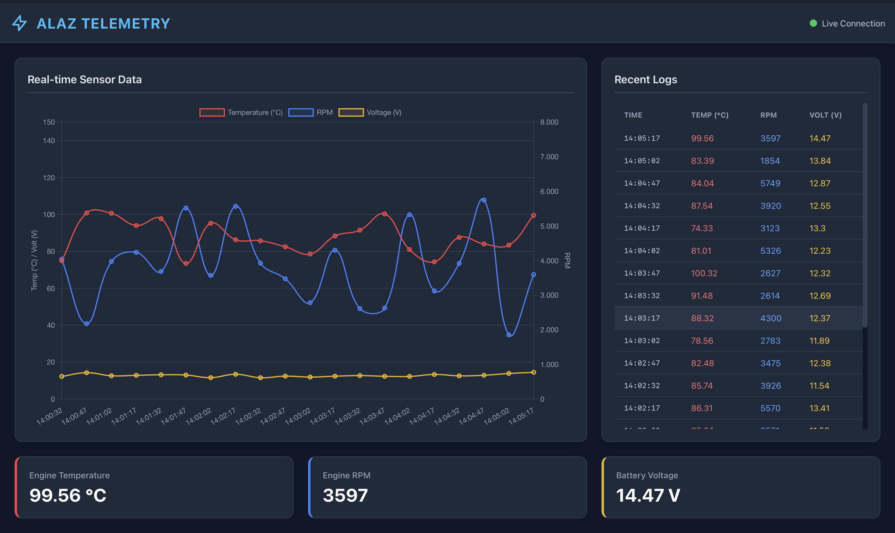

# Alaz Takımı - Mülakat Görevi 3

Bu proje, Alaz Takımı Full-Stack geliştirici mülakatı için hazırlanmış, FastAPI tabanlı canlı bir telemetri (mockup) sistemidir.

## Özellikler

- **FastAPI Backend:** Asenkron mimari ile yüksek performanslı veri sunumu.
- **Background Tasks:** Sistem ayağa kalktığında otomatik başlayan ve tam olarak 15 saniyede bir rastgele sensör verisi (Sıcaklık, RPM, Voltaj) üreten asenkron döngü.
- **SQLite Database:** Üretilen verilerin ISO 8601 zaman damgasıyla yerel bir veritabanına (`telemetry.db`) kaydedilmesi (ve optimize edilmiş sorgular).
- **Modern UI:** Tailwind CSS ile tasarlanmış, endüstriyel/teknolojik hissiyata sahip "Dark Mode" arayüz.
- **Canlı Grafikler:** Chart.js kullanılarak verilerin anlık ve dinamik olarak izlenmesi. Javascript `setInterval` ile logların güncellenmesi.
- **Clean Code & Type Hinting:** Python Pydantic modelleri ile tip güvenliği (Type Hinting) ve Clean Code prensiplerinin uygulanması.

## Kurulum ve Çalıştırma

Projeyi çalıştırmak için sisteminizde Python yüklü olması gerekmektedir (Önerilen: 3.8+).

1. **Gereksinimleri Yükleyin:**
   Proje dizininde aşağıdaki komutu çalıştırarak gerekli kütüphaneleri yükleyin:
   ```bash
   pip install -r requirements.txt
   ```

2. **Uygulamayı Başlatın:**
  2. **Uygulamayı Başlatın:**
   `backend` klasörüne girip FastAPI uygulamasını `uvicorn` ile ayağa kaldırın:
```bash
   cd backend
   uvicorn main:app --reload
```

3. **Arayüze Erişin:**
   Tarayıcınızı açın ve aşağıdaki adrese gidin:
   [http://localhost:8000](http://localhost:8000)

## Teknolojiler
- **Backend:** Python, FastAPI, SQLite (Standart Kütüphane), Pydantic
- **Frontend:** HTML, Tailwind CSS (CDN), Chart.js, Moment.js

## Neden Bu Teknolojiler?

- **FastAPI:** Asenkron (async/await) desteği sayesinde, 15 saniyede bir arka planda çalışan veri üretim görevi ile tarayıcıdan gelen istekleri aynı anda, birbirini bloklamadan karşılayabiliyor. Ayrıca Pydantic ile otomatik veri doğrulama (type validation) sağlıyor, bu da kod kalitesini artırıyor.
- **SQLite:** Proje küçük/orta ölçekli bir mockup sistemi olduğu için, ayrı bir veritabanı sunucusu kurmaya gerek kalmadan, Python'un kendi standart kütüphanesiyle hızlıca kalıcı veri saklama ihtiyacını karşılıyor. Kurulumu basit, taşınabilir (tek dosya) ve bu ölçekteki bir proje için yeterli performansı sunuyor.
- **Jinja2:** FastAPI ile doğal olarak entegre çalışan, HTML sayfasını backend üzerinden sunmamızı sağlayan hafif bir şablon motoru.
- **Tailwind CSS:** Hızlı ve tutarlı bir "dark mode" endüstriyel arayüz tasarımı için, önceden tanımlı class'larla CSS yazma ihtiyacını azaltıyor, geliştirme hızını artırıyor.
- **Chart.js:** Gerçek zamanlı sensör verilerini (sıcaklık, RPM, voltaj) okunabilir, çift eksenli (dual-axis) bir çizgi grafikte göstermek için hafif ve esnek bir grafik kütüphanesi.
- **Moment.js:** Zaman damgalarını (timestamp) kullanıcı için okunabilir saat formatına (`HH:mm:ss`) çevirmek için kullanıldı.


## Ekran Görüntüsü ve Demo



🎥 [Demo Videosu (30+ saniye)](screenshots/demo.mov)
